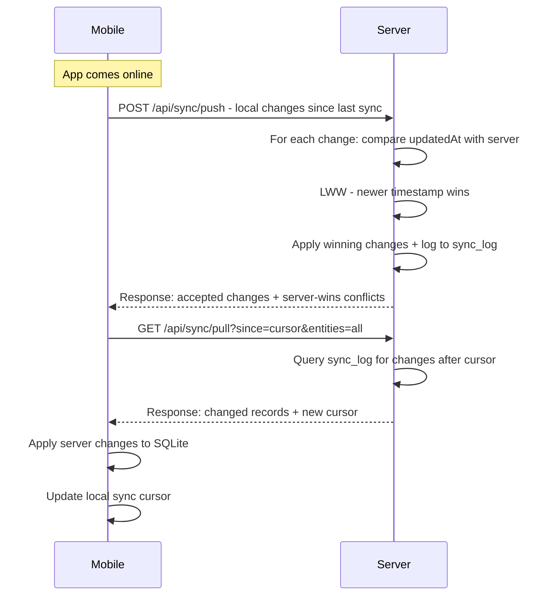
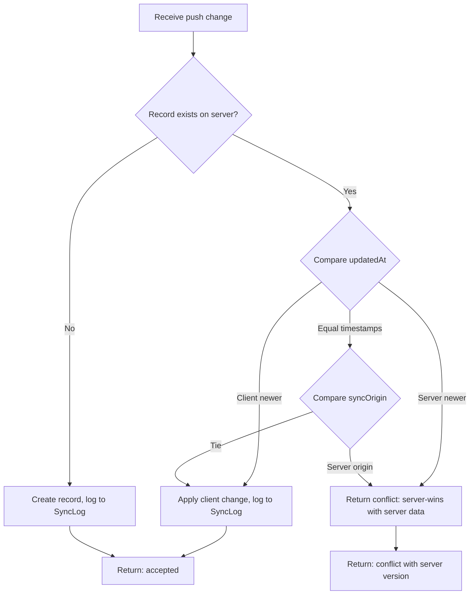
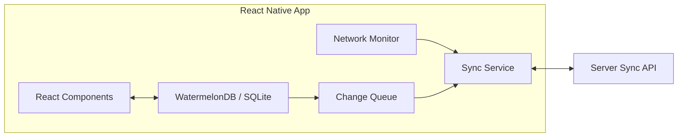

# App Cobrancas - Bidirectional Sync Architecture

## Context

Prepare the Next.js backend for **fully offline-first bidirectional synchronization** with a future React Native mobile app. All main entities sync. Conflict resolution: **last-write-wins** based on `updatedAt` timestamp.

---

## 1. Current State Assessment

### What already exists
- `Dispositivo` model with `deviceKey`, `senha`, `ativo`, `ultimoSync` -- basic device registry
- `version` field on most models -- can support optimistic locking
- `updatedAt` field on all models -- can serve as LWW timestamp
- `deletedAt` soft-delete on main entities -- compatible with sync
- WebSocket example in `examples/websocket/` -- can be adapted for real-time push notifications

### What is missing
- No change tracking / changelog mechanism
- No sync API endpoints (pull/push)
- No per-device sync cursor (last sync timestamp per entity per device)
- Dates stored as strings -- unreliable for LWW comparison
- No batch upsert support
- Device auth is web-only (cookie-based JWT) -- mobile needs token-based auth
- No data scoping (which device sees which data based on user/rota permissions)

---

## 2. Architecture Overview

```mermaid
flowchart TB
    subgraph Mobile [React Native - Offline First]
        SQLite[SQLite / WatermelonDB]
        SyncEngine[Sync Engine]
        ChangeLog[Local Change Log]
    end

    subgraph Backend [Next.js API]
        SyncAPI[/api/sync/pull and /api/sync/push]
        AuthAPI[/api/auth/device-login]
        ConflictResolver[LWW Conflict Resolver]
        ChangeTracker[Server Change Tracker]
    end

    subgraph Database [PostgreSQL]
        Tables[Entity Tables]
        SyncLog[sync_log table]
        DeviceSyncCursor[device_sync_cursor table]
    end

    SQLite <--> SyncEngine
    ChangeLog --> SyncEngine
    SyncEngine -- Push local changes --> SyncAPI
    SyncEngine -- Pull server changes --> SyncAPI
    SyncAPI --> ConflictResolver
    SyncAPI --> ChangeTracker
    ConflictResolver --> Tables
    ChangeTracker --> SyncLog
    SyncAPI --> DeviceSyncCursor
```

### Sync Flow



---

## 3. Schema Changes Required

### 3.1 New Models

```prisma
// Tracks every mutation for sync consumers
model SyncLog {
  id          String   @id @default(cuid())
  entidade    String   // cliente, produto, locacao, cobranca, etc.
  entidadeId  String
  operacao    String   // create, update, delete
  dados       String?  // JSON: full record snapshot after mutation
  updatedAt   DateTime // the entity updatedAt at time of change
  createdAt   DateTime @default(now)

  @@index([entidade, updatedAt])
  @@index([updatedAt])
}

// Tracks sync progress per device per entity
model DeviceSyncCursor {
  id            String   @id @default(cuid())
  dispositivoId String
  entidade      String
  lastSyncAt    DateTime // last successful pull cursor
  updatedAt     DateTime @updatedAt

  dispositivo   Dispositivo @relation(fields: [dispositivoId], references: [id])

  @@unique([dispositivoId, entidade])
}
```

### 3.2 Modifications to Existing Models

**All syncable entities** need these changes:

```prisma
// BEFORE - dates as strings
model Cobranca {
  dataInicio   String
  dataFim      String
  updatedAt    DateTime @updatedAt
}

// AFTER - proper DateTime + sync metadata
model Cobranca {
  dataInicio   DateTime
  dataFim      DateTime
  updatedAt    DateTime @updatedAt
  syncOrigin   String?  // deviceId or 'web' - who made the last change

  @@index([updatedAt])
  @@index([deletedAt])
}
```

**Key changes per entity:**
1. Migrate all date `String` fields to `DateTime`
2. Add `syncOrigin String?` to track where the last write came from
3. Add `@@index([updatedAt])` on every syncable model
4. Add `@@index([deletedAt])` on every soft-deletable model

**Dispositivo model updates:**

```prisma
model Dispositivo {
  id          String    @id @default(cuid())
  nome        String
  deviceKey   String    @unique
  senha       String    // hashed
  ativo       Boolean   @default(false)
  ultimoSync  DateTime?
  usuarioId   String?
  rotasPermitidas String @default("[]") // JSON array - scope data by rota

  usuario     Usuario?  @relation(fields: [usuarioId], references: [id])
  syncCursors DeviceSyncCursor[]
  createdAt   DateTime  @default(now())
  updatedAt   DateTime  @updatedAt
}
```

### 3.3 Entities to Sync

| Entity | Direction | Notes |
|--------|-----------|-------|
| Cliente | Bidi | Scoped by rota permission |
| Produto | Bidi | All products sync |
| Locacao | Bidi | Scoped by client rota |
| Cobranca | Bidi | Scoped by client rota |
| PagamentoCobranca | Bidi | Follows cobranca scope |
| Rota | Server-to-mobile | Reference data, read-only on mobile |
| TipoProduto | Server-to-mobile | Reference data |
| DescricaoProduto | Server-to-mobile | Reference data |
| TamanhoProduto | Server-to-mobile | Reference data |
| Estabelecimento | Server-to-mobile | Reference data |
| HistoricoRelogio | Bidi | Follows product scope |
| Manutencao | Bidi | Follows product scope |

---

## 4. API Endpoints

### 4.1 Device Authentication

```
POST /api/auth/device-login
Body: { deviceKey, senha }
Response: { token, expiresIn, user, rotasPermitidas }
```

Unlike web auth (cookie-based), mobile auth returns a Bearer token. The middleware needs updating to accept both `Cookie: auth-token` and `Authorization: Bearer <token>`.

### 4.2 Sync Push

```
POST /api/sync/push
Headers: Authorization: Bearer <token>
Body: {
  changes: [
    {
      entidade: "cobranca",
      entidadeId: "local-cuid-123",
      operacao: "create" | "update" | "delete",
      dados: { ...fullRecord },
      updatedAt: "2026-05-12T10:30:00Z"
    }
  ]
}
Response: {
  accepted: [ { entidadeId, serverEntidadeId, status: "applied" } ],
  conflicts: [ { entidadeId, serverVersion: {...}, status: "server-wins" } ],
  errors: [ { entidadeId, error: "..." } ]
}
```

### 4.3 Sync Pull

```
GET /api/sync/pull?since=2026-05-12T00:00:00Z&entities=cliente,cobranca,locacao
Headers: Authorization: Bearer <token>
Response: {
  changes: {
    cliente: [ { ...record, _operacao: "upsert" | "delete" } ],
    cobranca: [ ... ],
    locacao: [ ... ]
  },
  cursor: "2026-05-12T17:55:00Z",
  hasMore: false
}
```

Pull is paginated -- if `hasMore: true`, the client must call again with the returned `cursor`.

### 4.4 Sync Status

```
GET /api/sync/status
Headers: Authorization: Bearer <token>
Response: {
  deviceId: "...",
  cursors: {
    cliente: "2026-05-12T10:00:00Z",
    cobranca: "2026-05-12T09:30:00Z",
    ...
  },
  pendingChanges: 0
}
```

---

## 5. Server-Side Change Tracking

Every mutation (create, update, soft-delete) must write to `SyncLog`. This is best done via a **Prisma middleware** or a shared utility function.

### Approach: Prisma Extension

```typescript
// src/lib/db.ts - add sync logging extension
const prismaWithSync = db.$extends({
  query: {
    $allModels: {
      async create({ model, args, query }) {
        const result = await query(args)
        await writeSyncLog(model, result.id, 'create', result)
        return result
      },
      async update({ model, args, query }) {
        const result = await query(args)
        await writeSyncLog(model, result.id, 'update', result)
        return result
      },
      async updateMany({ model, args, query }) {
        // For batch updates, query affected IDs first
        const result = await query(args)
        // Log individually for sync tracking
        return result
      },
    },
  },
})
```

This ensures every write from web or API automatically creates a sync log entry without modifying every individual route handler.

---

## 6. Conflict Resolution: Last-Write-Wins



**Implementation in push handler:**

```typescript
async function resolveConflict(change, serverRecord) {
  const clientTime = new Date(change.updatedAt).getTime()
  const serverTime = new Date(serverRecord.updatedAt).getTime()

  if (!serverRecord || clientTime > serverTime) {
    return { action: 'apply-client', record: change.dados }
  }
  return { action: 'server-wins', serverVersion: serverRecord }
}
```

---

## 7. Data Scoping

Mobile devices should only receive data they are authorized to see, based on `rotasPermitidas`:

- **Clientes**: only those whose `rotaId` is in the device's allowed rotas
- **Locacoes/Cobrancas**: only those linked to allowed clients
- **Produtos**: all (no rota restriction)
- **Reference data**: all (read-only)

The pull endpoint must filter by the device's permitted rotas:

```typescript
const allowedRotas = JSON.parse(dispositivo.rotasPermitidas)
const clienteWhere = allowedRotas.length > 0
  ? { rotaId: { in: allowedRotas } }
  : {} // empty = all rotas (admin)
```

---

## 8. Implementation Action Items

### Phase 1: Schema Preparation
- [ ] Migrate all date `String` fields to `DateTime` across the Prisma schema
- [ ] Add `syncOrigin String?` field to all syncable entities
- [ ] Add `@@index([updatedAt])` and `@@index([deletedAt])` to all syncable models
- [ ] Create `SyncLog` model
- [ ] Create `DeviceSyncCursor` model
- [ ] Update `Dispositivo` model with `rotasPermitidas` and relation to `DeviceSyncCursor`
- [ ] Convert JSON `String` fields to native Prisma `Json` type
- [ ] Generate and run migration

### Phase 2: Change Tracking
- [ ] Implement Prisma Extension for automatic `SyncLog` writes on create/update/delete
- [ ] Add `syncOrigin` parameter to all existing API route handlers (default: `'web'`)
- [ ] Add a cleanup cron job to prune old `SyncLog` entries (e.g., older than 90 days)
- [ ] Ensure all soft-deletes write to `SyncLog` with `operacao: 'delete'`

### Phase 3: Sync API Endpoints
- [ ] Create `POST /api/auth/device-login` with Bearer token response
- [ ] Update middleware to accept both Cookie and Bearer token auth
- [ ] Create `POST /api/sync/push` with LWW conflict resolution
- [ ] Create `GET /api/sync/pull` with cursor-based pagination and rota scoping
- [ ] Create `GET /api/sync/status` for device sync health check
- [ ] Add rate limiting to sync endpoints
- [ ] Add request size limits for push batches (e.g., max 500 changes per request)

### Phase 4: Data Integrity
- [ ] Wrap all push operations in `db.$transaction()` for atomicity
- [ ] Implement ID mapping (mobile local CUIDs to server CUIDs) for newly created records
- [ ] Handle cascading sync: when a client syncs, related locacoes/cobrancas must also be checked
- [ ] Add validation that pushed data respects the same Zod schemas as web
- [ ] Implement `version` field checking alongside LWW for extra safety

### Phase 5: Operational Readiness
- [ ] Add sync-specific audit logging (separate from `LogAuditoria`) for debugging
- [ ] Create admin dashboard view showing device sync status, last sync times, error counts
- [ ] Add monitoring alerts for devices that haven't synced in N hours
- [ ] Document the sync protocol for the React Native team
- [ ] Add integration tests for push/pull/conflict scenarios

### Phase 6: Critical Fixes from Code Review (prerequisites)
- [ ] Fix `getViewParent` navigation typo
- [ ] Remove hardcoded JWT secret fallback
- [ ] Consolidate JWT secret into shared module
- [ ] Remove cron default secret
- [ ] Enable TypeScript build errors (`ignoreBuildErrors: false`)

---

## 9. Recommended Mobile-Side Architecture (for React Native team)



**Recommended stack:**
- **WatermelonDB** -- optimized for React Native, built-in change tracking, lazy loading, supports sync protocols natively
- **NetInfo** -- React Native network status detection for triggering sync
- **Background Fetch** -- iOS/Android background sync when app is not in foreground

WatermelonDB has a built-in `synchronize()` function that expects exactly the pull/push API shape described above, making it the ideal match for this architecture.

---

## 10. Migration Strategy

Since the app is in production, the schema migration (especially date String to DateTime) needs careful handling:

1. **Create a migration script** that converts existing string dates to proper DateTime values
2. **Deploy schema changes** with the new sync tables first (additive, non-breaking)
3. **Deploy the Prisma Extension** for SyncLog writes (transparent to existing code)
4. **Deploy sync endpoints** behind a feature flag
5. **Test with a single device** before rolling out to all mobile users
6. **Backfill SyncLog** for existing records so mobile devices can do an initial full sync
