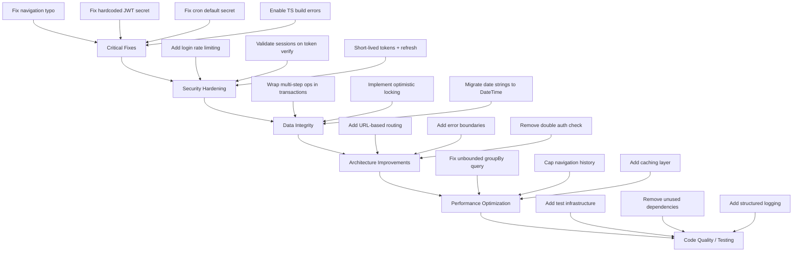

# App Cobrancas - Code Review: Improvements, Fixes, and Future Problems

## Project Overview

A Next.js 16 billing management system (sistema de cobrancas) for equipment rental companies, built with TypeScript, Prisma/PostgreSQL, Zustand, shadcn/ui, and Zod v4. The app is a single-page application with client-side routing via Zustand store, JWT auth via cookies, and a comprehensive API layer.

---

## 1. Critical Bugs (Fix Immediately)

### 1.1 Navigation typo returns invalid ViewType
In [`getViewParent()`](src/lib/store/navigation.ts:84), the cobranca branch returns `'cobranças'` (with cedilla) instead of `'cobrancas'`, which is not a valid `ViewType`. This will cause silent failures or runtime errors when navigating back from cobranca detail/edit views.

```typescript
// Line 84 - BUG
if (view.startsWith('cobranca-')) return 'cobranças'  // WRONG
// Should be:
if (view.startsWith('cobranca-')) return 'cobrancas'
```

### 1.2 Hardcoded JWT secret in production fallback
In both [`src/lib/auth-jwt.ts:5`](src/lib/auth-jwt.ts:5) and [`src/middleware.ts:6`](src/middleware.ts:6), the JWT secret falls back to a hardcoded string `'app-cobrancas-secret-key-min-32-chars!!'` when `JWT_SECRET` env var is missing. If the env var is accidentally unset in production, the app silently uses this public default, which is a severe security vulnerability.

**Fix:** Throw an error at startup if `JWT_SECRET` is not defined in production, or at minimum log a critical warning.

### 1.3 Duplicated JWT secret definition
The JWT secret is defined independently in two files ([`src/lib/auth-jwt.ts`](src/lib/auth-jwt.ts:4) and [`src/middleware.ts`](src/middleware.ts:5)). If one is updated and the other is not, tokens signed by one will fail verification in the other, silently breaking auth.

**Fix:** Extract the secret into a shared constants file or a single utility.

### 1.4 Cron endpoint has a weak default secret
In [`src/app/api/cron/vencimento/route.ts:11`](src/app/api/cron/vencimento/route.ts:11), the fallback `'cron-secret-default'` means anyone can trigger the cron job if `CRON_SECRET` is not set. This could mark all pending charges as overdue.

### 1.5 TypeScript build errors are silenced
In [`next.config.ts:6`](next.config.ts:6), `ignoreBuildErrors: true` hides all TypeScript errors during build. This means type-safety bugs ship to production undetected.

**Fix:** Remove `ignoreBuildErrors: true` and fix all existing TS errors.

---

## 2. Security Issues

### 2.1 No rate limiting on login endpoint
The [`/api/auth/login`](src/app/api/auth/login/route.ts:8) endpoint has no rate limiting. Brute-force attacks can try unlimited password combinations. The audit log for failed attempts is good, but it does not prevent the attack.

**Fix:** Add rate limiting (e.g., using `upstash/ratelimit` or a simple in-memory counter per IP).

### 2.2 JWT token is never invalidated on logout
The [`logout`](src/lib/store/auth.ts:44) function clears the client-side cookie and state, and presumably deletes from `Sessao`, but the JWT itself remains valid for 7 days. If a token is stolen, it cannot be revoked.

**Fix:** Implement a token blacklist (Redis or DB check) or switch to short-lived tokens + refresh tokens.

### 2.3 Session table exists but is never validated
The `Sessao` model stores tokens in the DB, but the middleware ([`src/middleware.ts`](src/middleware.ts:38)) only verifies the JWT signature -- it never checks if the session exists in the DB or has been revoked.

**Fix:** Either remove the Sessao table (if not needed) or check it during token verification.

### 2.4 No CSRF protection
The API uses cookie-based auth with `sameSite: 'lax'`, which provides some protection but is not sufficient for all cross-origin attack vectors. There is no CSRF token mechanism.

### 2.5 Permissions stored in JWT are stale
User permissions are embedded in the JWT at login time ([`src/app/api/auth/login/route.ts:38-48`](src/app/api/auth/login/route.ts:38)). If an admin changes a user's permissions, the old JWT remains valid for 7 days with the old permissions. The `/api/auth/me` endpoint fetches fresh data, but the middleware and many routes use the JWT payload directly.

---

## 3. Database & Schema Issues

### 3.1 Dates stored as strings instead of DateTime
Multiple models store dates as `String` rather than `DateTime`:
- `Locacao.dataLocacao`, `dataFim`, `dataPrimeiraCobranca`
- `Cobranca.dataInicio`, `dataFim`, `dataPagamento`, `dataVencimento`
- `Manutencao.dataInicio`, `dataFim`
- `Usuario.dataUltimoAcesso`

This prevents proper date-based queries, sorting, and timezone handling at the database level. String comparisons like `{ dataVencimento: { lt: today } }` in the [cron route](src/app/api/cron/vencimento/route.ts:29) work only if all dates use the exact same format (ISO `YYYY-MM-DD`), which is fragile.

**Fix:** Migrate these columns to `DateTime` type.

### 3.2 Denormalized data creates consistency risks
Several models store denormalized copies of related data:
- `Locacao` stores `clienteNome`, `produtoIdentificador`, `produtoTipo`
- `Cobranca` stores `clienteNome`, `produtoIdentificador`
- `Manutencao` stores `produtoIdentificador`, `usuarioNome`
- `Produto` stores `tipoNome`, `descricaoNome`, `tamanhoNome`

If the source entity is renamed, these copies become stale. There is no update cascade mechanism.

**Fix:** Either remove denormalized fields and use JOINs (via Prisma `include`), or add update hooks to propagate name changes.

### 3.3 JSON stored as strings
`Usuario.permissoesWeb`, `permissoesMobile`, `rotasPermitidas`, and `Cliente.contatos` store JSON as `String`. This prevents querying JSON fields and requires manual `JSON.parse()` everywhere, which can throw if data is corrupted.

**Fix:** Use Prisma's `Json` type for PostgreSQL, which maps to native `jsonb`.

### 3.4 Missing database indexes
There are no explicit indexes defined beyond `@id` and `@unique`. High-traffic queries (filtering by `status`, `deletedAt`, `rotaId`, `clienteId`, `locacaoId`, date ranges) will perform full table scans as data grows.

**Fix:** Add `@@index` for frequently queried columns.

### 3.5 Soft-delete is inconsistent
Most models have `deletedAt` but `Notificacao`, `Meta`, `PagamentoCobranca`, `HistoricoRelogio`, `Sessao`, `Dispositivo` do not. Queries check `deletedAt: null` inconsistently.

---

## 4. Architecture Issues

### 4.1 SPA without URL routing
The entire app is a single `page.tsx` with client-side navigation managed by a Zustand store ([`src/lib/store/navigation.ts`](src/lib/store/navigation.ts)). This means:
- Browser back/forward buttons do not work
- URLs are not shareable (everything is `/`)
- No deep linking
- SEO is impossible (though less relevant for an internal tool)
- History stack grows unbounded in memory

**Fix:** Migrate to Next.js App Router with proper `app/` directory routing, or at minimum sync Zustand state with `window.history` / URL params.

### 4.2 No error boundaries
There are no React Error Boundaries. A runtime error in any view crashes the entire app.

**Fix:** Add error boundaries at the layout level and around each view.

### 4.3 Double auth check pattern
The middleware already validates JWT for all `/api/*` routes, but every API handler also calls `getAuthSession()` redundantly. This adds extra DB round-trips and cookie parsing.

**Fix:** Use the `x-user-id` / `x-user-email` headers set by middleware, or consolidate the auth check in one place.

### 4.4 No API response type safety
API routes return untyped JSON. The frontend fetches with raw `fetch()` and has no shared types or API client. This leads to runtime errors when API shapes change.

**Fix:** Create shared API types or use a library like `tRPC` / typed fetch wrappers.

### 4.5 `reactStrictMode: false`
Disabling strict mode in [`next.config.ts:8`](next.config.ts:8) hides double-render bugs and side-effect issues that will surface in production.

---

## 5. Code Quality Issues

### 5.1 Inconsistent error handling in API routes
Error handling follows a fragile pattern checking for `'issues' in error` to detect Zod errors ([`src/app/api/clientes/route.ts:82`](src/app/api/clientes/route.ts:82)). This does not work reliably with Zod v4 which uses `ZodError`.

**Fix:** Use `instanceof ZodError` or wrap all routes in a shared error handler.

### 5.2 No testing infrastructure
There are zero test files. No unit tests, integration tests, or E2E tests. The project has screenshots in `download/` that suggest manual QA only.

**Fix:** Add Jest/Vitest for unit tests, and Playwright/Cypress for E2E.

### 5.3 `console.error` as the only error reporting
All errors are logged with `console.error`. In production, these are lost unless a log aggregation service is configured.

**Fix:** Add structured logging (e.g., Pino) and error tracking (e.g., Sentry).

### 5.4 Unused dependency: `next-auth`
The project uses custom JWT auth via `jose` but still has `next-auth` in [`package.json:67`](package.json:67). This adds ~200KB to the bundle for no benefit.

### 5.5 Unused dependency: `next-intl`
[`next-intl`](package.json:68) is listed but there is no i18n configuration or usage anywhere in the codebase. The entire app is hardcoded in Portuguese.

---

## 6. Performance Concerns

### 6.1 Grouped cobrancas query loads ALL records
The [`groupBy=route`](src/app/api/cobrancas/route.ts:50) mode in the cobrancas API fetches ALL matching records into memory to do in-app grouping. With thousands of records, this will cause OOM or extreme latency.

**Fix:** Use SQL `GROUP BY` via Prisma's `groupBy()` or raw queries, or implement pagination for grouped results.

### 6.2 No caching strategy
Every API call hits the database directly. Frequently-read data (dashboard stats, rota lists, tipo/descricao/tamanho lists) should be cached.

**Fix:** Add `React Query` caching on the frontend (already installed but usage unclear), and consider server-side caching for reference data.

### 6.3 Navigation history grows unbounded
The [`history`](src/lib/store/navigation.ts:48) array in the navigation store is never trimmed. Long user sessions accumulate thousands of entries.

**Fix:** Cap the history to a reasonable size (e.g., 50 entries).

---

## 7. Data Integrity Risks

### 7.1 No database transactions for multi-step operations
Creating a cobranca involves multiple DB writes (create cobranca, update locacao, create audit log) but none are wrapped in a transaction. A failure midway leaves the database in an inconsistent state.

**Fix:** Use `db.$transaction()` for all multi-step operations.

### 7.2 Optimistic locking `version` field is never checked
All major models have a `version` field but no API route checks it before updates. Concurrent edits will silently overwrite each other.

**Fix:** Implement optimistic locking: check `version` in the `WHERE` clause and increment on update.

### 7.3 No cascade delete rules
Deleting a `Cliente` does not cascade to `Locacao` or `Cobranca`. The soft-delete pattern partially addresses this, but hard deletes (if ever triggered) would leave orphaned records.

---

## 8. Recommended Action Items (Priority Order)



### Tier 1 - Critical (bugs and security holes)
- [ ] Fix `getViewParent` typo returning invalid `'cobranças'`
- [ ] Remove hardcoded JWT secret fallback; fail if env is missing
- [ ] Consolidate JWT secret into a single shared module
- [ ] Remove `CRON_SECRET` default fallback
- [ ] Set `ignoreBuildErrors: false` and fix all TS errors
- [ ] Re-enable `reactStrictMode: true`

### Tier 2 - Security
- [ ] Add rate limiting to login endpoint
- [ ] Validate session exists in DB during token verification (or remove Sessao table)
- [ ] Implement short-lived access tokens + refresh token rotation
- [ ] Add mechanism to invalidate stale permission claims in JWT

### Tier 3 - Data Integrity
- [ ] Wrap all multi-step API operations in `db.$transaction()`
- [ ] Implement optimistic locking using the existing `version` field
- [ ] Migrate date `String` fields to `DateTime` across the schema
- [ ] Convert JSON string fields to native `Json` type
- [ ] Add database indexes for `status`, `deletedAt`, `clienteId`, `locacaoId`, `rotaId`, date columns

### Tier 4 - Architecture
- [ ] Implement URL-based routing (sync Zustand with browser history, or migrate to App Router pages)
- [ ] Add React Error Boundaries at layout and view level
- [ ] Eliminate double auth check (middleware + handler)
- [ ] Create shared API types between frontend and backend
- [ ] Standardize error handling with a shared handler utility

### Tier 5 - Performance
- [ ] Refactor grouped cobrancas query to use DB-level aggregation with pagination
- [ ] Cap navigation history array to prevent memory leaks
- [ ] Implement caching for reference data (rotas, tipos, descricoes, tamanhos)

### Tier 6 - Code Quality
- [ ] Set up test framework (Vitest) and write unit tests for business logic (`cobranca-calculos`, `validations`)
- [ ] Add E2E tests for critical flows (login, create client, create cobranca)
- [ ] Remove unused dependencies (`next-auth`, `next-intl`)
- [ ] Add structured logging and error tracking
- [ ] Standardize denormalized data handling (either remove or add sync mechanisms)
